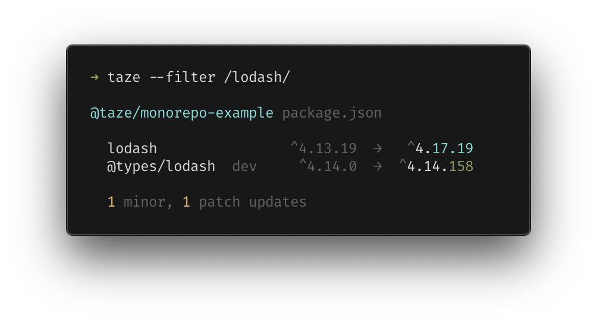

<h1 align="center">🥦 Taze<sup>𝛼</sup></h1>
<p align="center"><sup>(/ta:zei/, <em>fresh</em> in Turkish)</sup></p>
<p align="center">A modern cli tool that keeps your deps fresh</p>

<pre align="center">npx <b>taze</b></pre>

<p align="center">or recursively for <b>monorepos</b></p>

<pre align="center">npx taze <b>-r</b></pre>

<p align='center'>

</p>

## Features

- Built-in support for monorepos
- No installation required - `npx taze`
- Safe by default - updates in the version range your allowed

## Usage

By default, `taze` will only bump versions in the ranges you specified in package.json *(which is safe and the default behavior of `npm install`)*

<p align='center'>

</p>

To ignore the ranges, if you explicitly set the maximum allowenace version changes. 

For example `taze major` will check all changes and bump to the lastest stable changes including majors(breaking changes), or `taze minor` that bump to lastest minor changes within the same major version.

<br>
<p align='center'>
Check for <b>major</b> updates
<br>

</p>


<p align='center'>
Check up to <b>minor</b> updates
<br>

</p>

<p align='center'>
Check up to <b>patch</b> updates
<br>

</p>


### Monorepo

`taze` has the built-in first-class monorepo support. Simply adding `-r`, it will scan the subdirectories that contains `package.json` and update them together. It will handles in local private packages automatically.

<p align='center'>

</p>

## Configures

See `taze --help` for more details

### Filter

You can filter out packages you want to check for upgrades by string or regex.

```bash
taze --filter lodash,webpack
taze --filter /(lo|hi)dash/ # regex is also supported
```

<p align='center'>

</p>


## Programmatic APIs

> TODO:

## Alternatives

`taze` is inspired from the following tools.

- [npm-check-updates](https://github.com/raineorshine/npm-check-updates)
- [npm-check](https://github.com/dylang/npm-check)

They work well but have different focuses and feature sets, try them out as well :)

## Thanks

Great thanks to [@sinoon](https://github.com/sinoon) who helped a lot on having idea brainstroming and feedback discussion. 