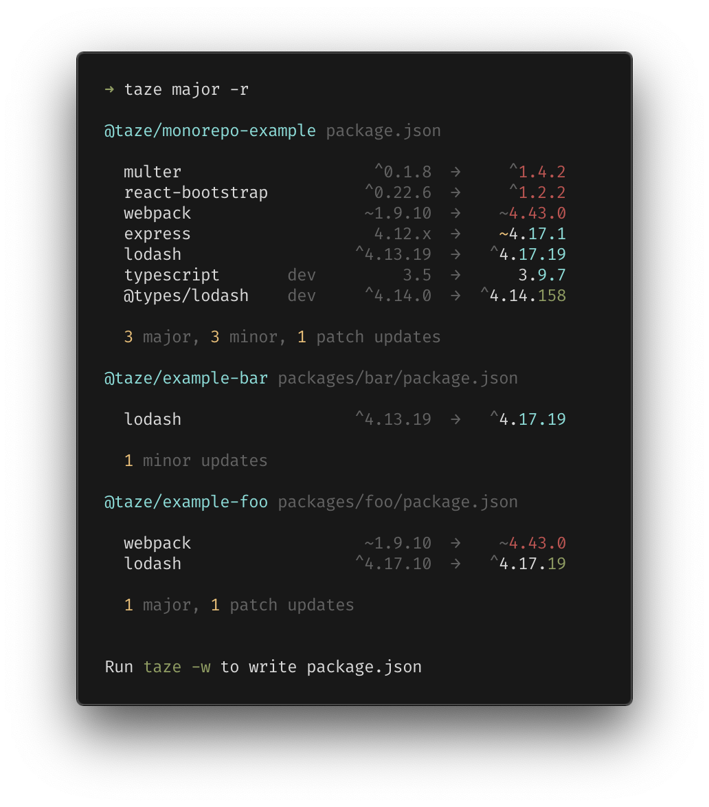
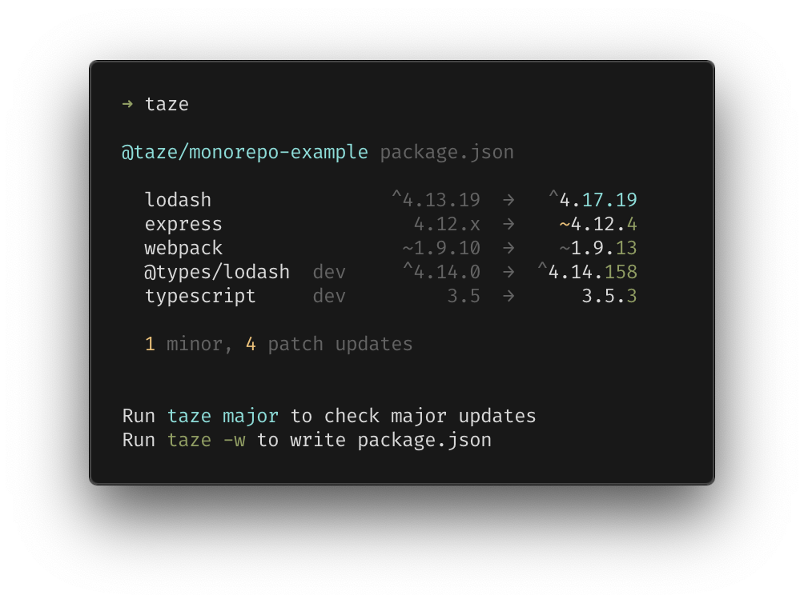
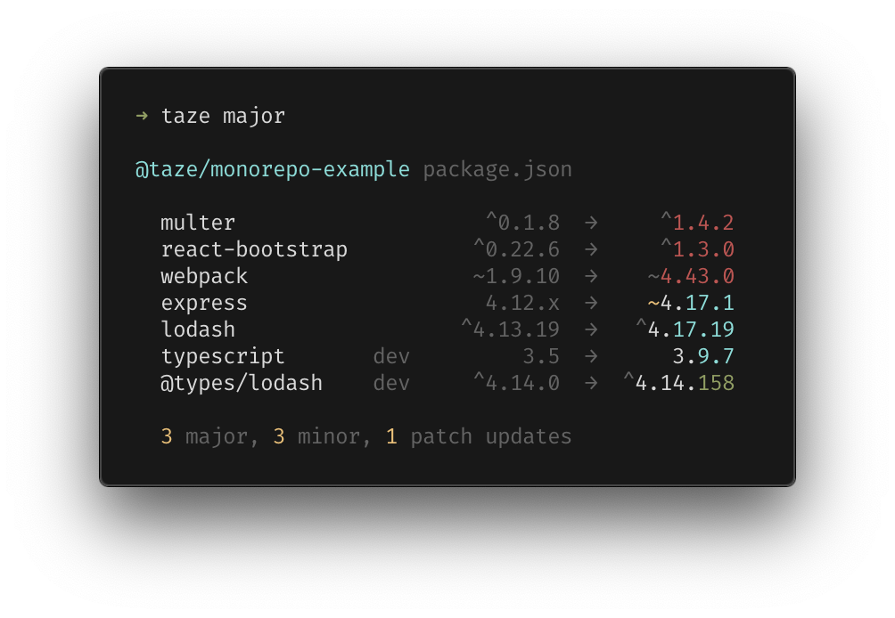
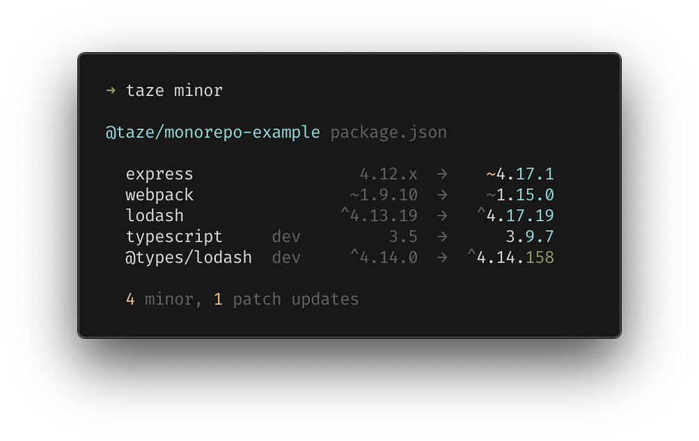
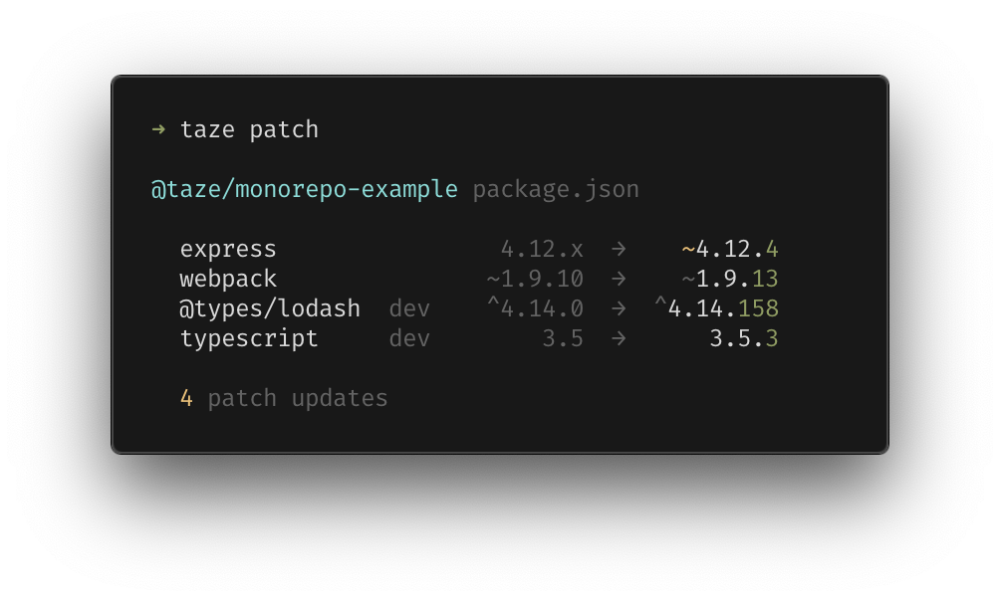
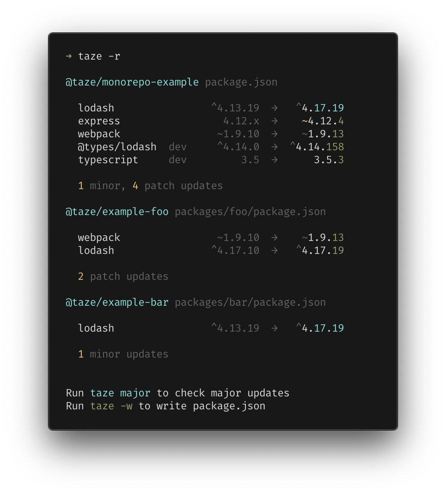

<h1 align="center">🥦 Taze</h1>
<p align="center"><sup>(/ta:zei/, <em>fresh</em> in Persian)</sup></p>
<p align="center">A modern cli tool that keeps your deps fresh</p>

<pre align="center">npx <b>taze</b></pre>

<p align="center">or recursively for <b>monorepos</b></p>

<pre align="center">npx taze <b>-r</b></pre>

<p align='center'>

</p>

## Features

- Built-in support for monorepos
- No installation required — `npx taze`
- Safe by default — updates in the version range you are allowed

## Usage

By default, `taze` will only bump versions in the ranges you specified in `package.json` *(which is safe and the default behavior of `npm install`)*

<p align='center'>

</p>

To ignore the ranges, explicitly set the maximum allowed version change.

For example `taze major` will check all changes and bump to the latest stable changes including majors (breaking changes), or `taze minor` that bump to latest minor changes within the same major version.

<br>
<p align='center'>
Check for <b>major</b> updates
<br>

</p>

<p align='center'>
Check up to <b>minor</b> updates
<br>

</p>

<p align='center'>
Check up to <b>patch</b> updates
<br>

</p>

### Monorepo

`taze` has the built-in first-class monorepo support. Simply adding `-r` will scan the subdirectories that contain `package.json` and update them together. It will handle local private packages automatically.

<p align='center'>

</p>

## Configures

See `taze --help` for more details

### Filters

You can filter out packages you want to check for upgrades by `--include` or `--exclude`; they accept string and regex, separated by commas (,).

```bash
taze --include lodash,webpack
taze --include /react/ --exclude react-dom # regex is also supported
```

### Lockedversion

Locked (fixed version without `^` or `~`) packages are skipped by default, use `taze --include-locked` or `taze -l` to show them.

### Config file

With `taze.config.js` file, you can configure the same options the command has.

```js
import { defineConfig } from 'taze'

export default defineConfig({
  // ignore packages from bumping
  exclude: [
    'webpack'
  ],
  // fetch latest package info from registry without cache
  force: true,
  // write to package.json
  write: true,
  // run `npm install` or `yarn install` right after bumping
  install: true,
  // override with different bumping mode for each package
  packageMode: {
    'typescript': 'major',
    'unocss': 'ignore',
    // regex starts and ends with '/'
    '/vue/': 'latest'
  },
  // disable checking for "overrides" package.json field
  depFields: {
    overrides: false
  }
})
```

## Alternatives

`taze` is inspired by the following tools.

- [npm-check-updates](https://github.com/raineorshine/npm-check-updates)
- [npm-check](https://github.com/dylang/npm-check)

They work well but have different focuses and feature sets, try them out as well :)

## Thanks

Great thanks to [@sinoon](https://github.com/sinoon) who helped a lot with idea brainstorming and feedback discussion.

## License

MIT License © 2020 [Anthony Fu](https://github.com/antfu)
