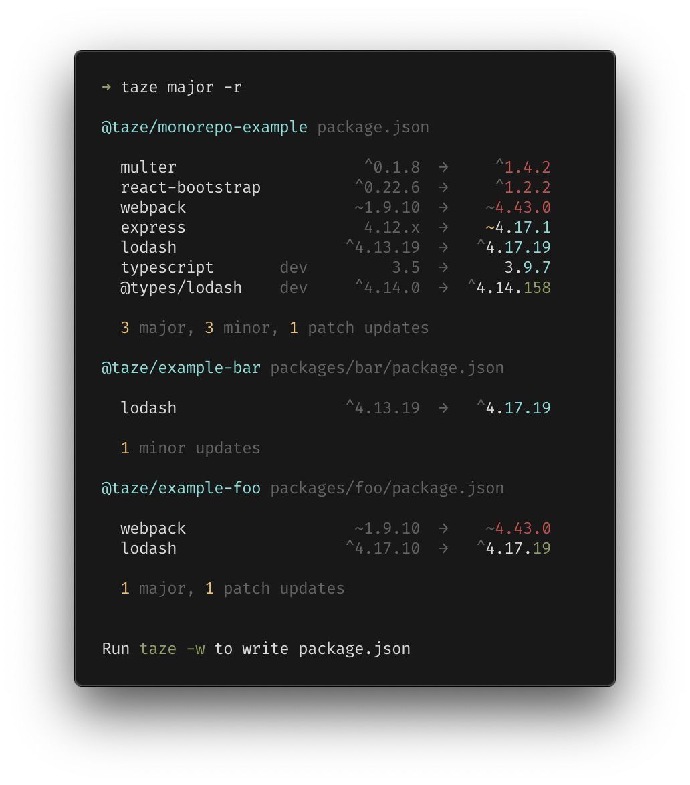
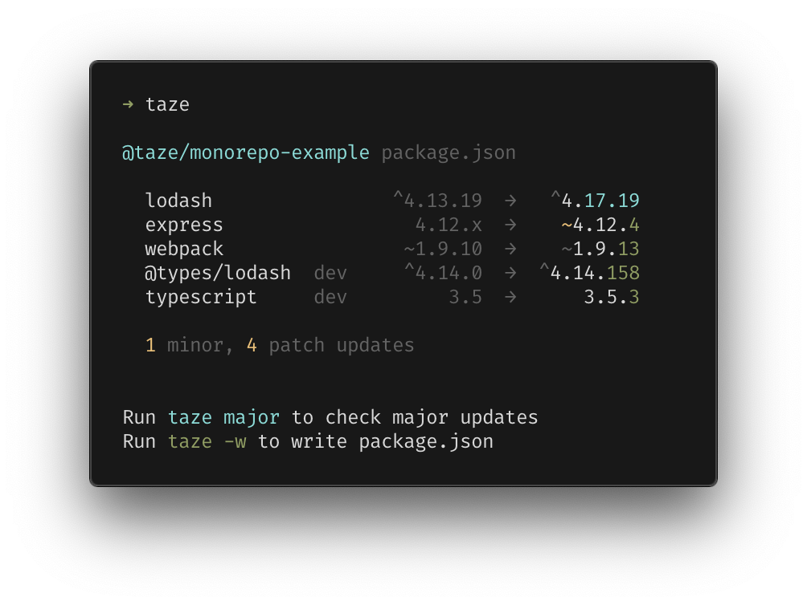
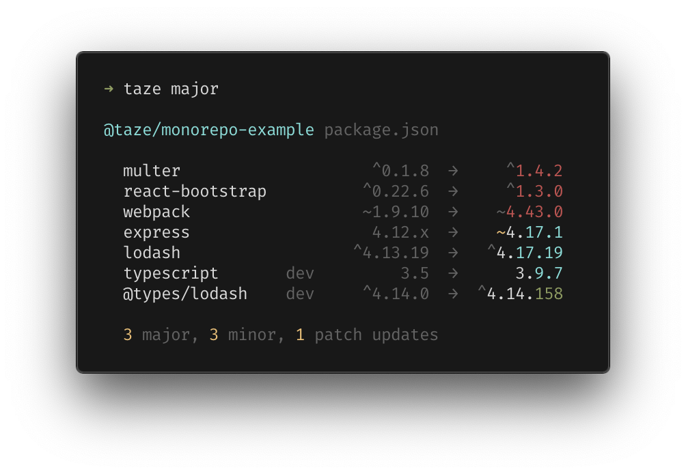
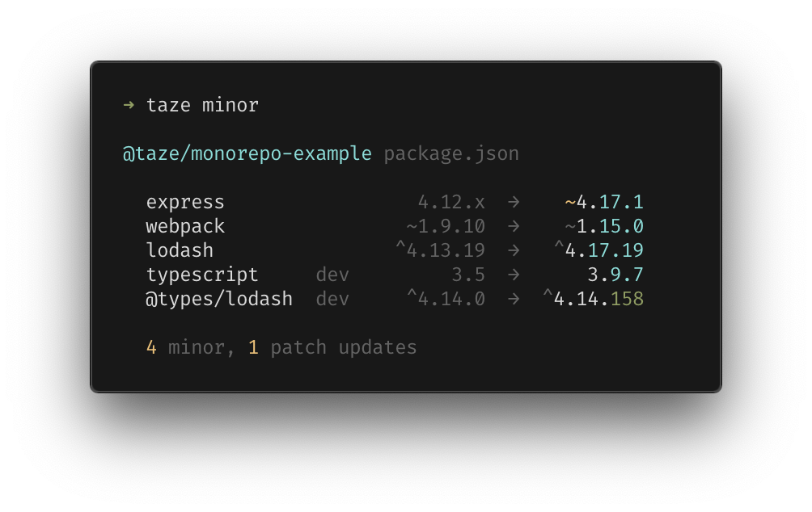
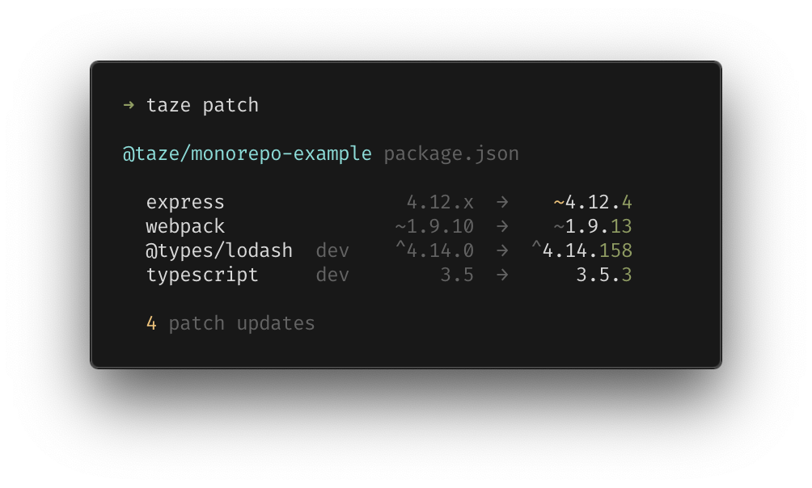
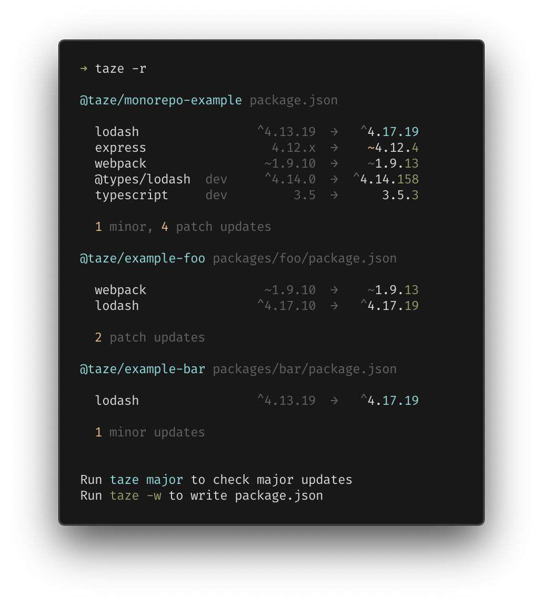

<h1 align="center">🥦 Taze</h1>
<p align="center"><sup>(/ta:zei/, <em>fresh</em> in Persian)</sup></p>
<p align="center">A modern cli tool that keeps your deps fresh</p>

<pre align="center">npx <b>taze</b></pre>

<p align="center">or recursively for <b>monorepos</b></p>

<pre align="center">npx taze <b>-r</b></pre>

<p align='center'>

</p>

## Fork 说明（@whyjs/taze）

本仓库为 [antfu-collective/taze](https://github.com/antfu-collective/taze) 的个人 fork，npm 包名为 **`@whyjs/taze`**，版本格式为 `{upstream}-fix.{N}`（`fix.N` 在发布时递增）。

### 发布包

| npm 包 | CLI 命令 | 说明 |
|---|---|---|
| `@whyjs/taze` | `taze` | 主包，完整功能 |
| `uploom` | `uploom` | 短包名 wrapper，`npx uploom` 等价于完整 CLI |

```bash
npm i -g @whyjs/taze   # → taze
npm i -g uploom        # → uploom（更短的 npx 入口）
```

### 相较上游新增功能

- **可配置请求超时**：`--timeout <ms>`（默认 10000）
- **npm 镜像管理**（兼容 nrm 使用习惯）：
  - 切换镜像通过 `npm config set`，不直接改写 `~/.npmrc` 中的 token
  - 自定义镜像列表保存在 `~/.taze/registries.yaml`（YAML 格式）
  - 首次运行可自动从 `~/.nrmrc` 迁移
- **双包发布**：CI 使用 `pnpm -r publish` 同时发布 `@whyjs/taze` 与 `uploom`

### 镜像管理命令

`registry` 可缩写为 **`reg`**（`taze reg` = `taze registry`，`uploom reg` 同理）。

```bash
taze reg ls                   # 列出镜像
taze reg current              # 当前镜像
taze reg use taobao           # 切换镜像
taze reg add <name> <url> [home]
taze reg del <name>
taze reg test [name]          # 测速

# 短包名同样可用（reg 缩写同样有效）
npx uploom reg use taobao
npx uploom minor -w
```

## Features

- Built-in support for monorepos
- No installation required — `npx taze`
- Safe by default — updates in the version range you are allowed

## Usage

By default, `taze` will only bump versions in the ranges you specified in `package.json` *(which is safe and the default behavior of `npm install`)*

<p align='center'>

</p>

To ignore the ranges, explicitly set the maximum allowed version change.

For example `taze major` will check all changes and bump to the latest stable changes including majors (breaking changes), or `taze minor` that bump to latest minor changes within the same major version.

<br>
<p align='center'>
Check for <b>major</b> updates
<br>

</p>

<p align='center'>
Check up to <b>minor</b> updates
<br>

</p>

<p align='center'>
Check up to <b>patch</b> updates
<br>

</p>

### Monorepo

`taze` has the built-in first-class monorepo support. Simply adding `-r` will scan the subdirectories that contain `package.json` and update them together. It will handle local private packages automatically.

<p align='center'>

</p>

## Configuration

See `taze --help` for more details

### Filters

You can filter out packages you want to check for upgrades by `--include` or `--exclude`; they accept string and regex, separated by commas (,).

```bash
taze --include lodash,webpack
taze --include /react/ --exclude react-dom # regex is also supported
```

### Locked Versions

Locked (fixed version without `^` or `~`) packages are skipped by default, use `taze --include-locked` or `taze -l` to show them.

### Peer Dependencies

Bumping version in `peerDependencies` is not enabled by default. Pass `--peer` option to include them in the update process.

```bash
taze --peer
```

### Maturity Period

By default the most recent version of a dependency is used. You may choose to filter to versions that have been out longer by passing `--maturity-period`.

```bash
taze --maturity-period
```

The filter when using the maturity-period flag is 7 days. You may also want to pass a day value to have a longer or shorter number of days.

```bash
taze --maturity-period 14
```

You can exclude packages from the maturity filter. This is also inferred from package manager config when available, such as `minimumReleaseAgeExclude` in `pnpm-workspace.yaml` and `npmPreapprovedPackages` in `.yarnrc.yml`.

```bash
taze --maturity-period-exclude react,webpack
```

If you want stable releases only while still honoring the maturity period, use `stable` mode.

```bash
taze stable --maturity-period 14
```

> [!NOTE]
> This kind of filtering is sometimes called `cooldown` or `minimumReleaseAge` by other tools.

### Config file

With `taze.config.js` file, you can configure the same options the command has.

```js
import { defineConfig } from 'taze'

export default defineConfig({
  // ignore packages from bumping
  exclude: [
    'webpack'
  ],
  // fetch latest package info from registry without cache
  force: true,
  // write to package.json
  write: true,
  // run `npm install` or `yarn install` right after bumping
  install: true,
  // ignore paths for looking for package.json in monorepo
  ignorePaths: [
    '**/node_modules/**',
    '**/test/**',
  ],
  // ignore package.json that in other workspaces (with their own .git,pnpm-workspace.yaml,etc.)
  ignoreOtherWorkspaces: true,
  // override with different bumping mode for each package
  packageMode: {
    'typescript': 'major',
    'unocss': 'ignore',
    // regex starts and ends with '/'
    '/vue/': 'latest'
  },
  // exclude packages from the maturity period filter
  maturityPeriodExclude: [
    'react',
    '@myorg/*',
  ],
  // disable checking for "overrides" package.json field
  depFields: {
    overrides: false
  }
})
```

## Alternatives

`taze` is inspired by the following tools.

- [npm-check-updates](https://github.com/raineorshine/npm-check-updates)
- [npm-check](https://github.com/dylang/npm-check)

They work well but have different focuses and feature sets, try them out as well :)

## Thanks

Great thanks to [@sinoon](https://github.com/sinoon) who helped a lot with idea brainstorming and feedback discussion.

## License

MIT License © 2020 [Anthony Fu](https://github.com/antfu)
