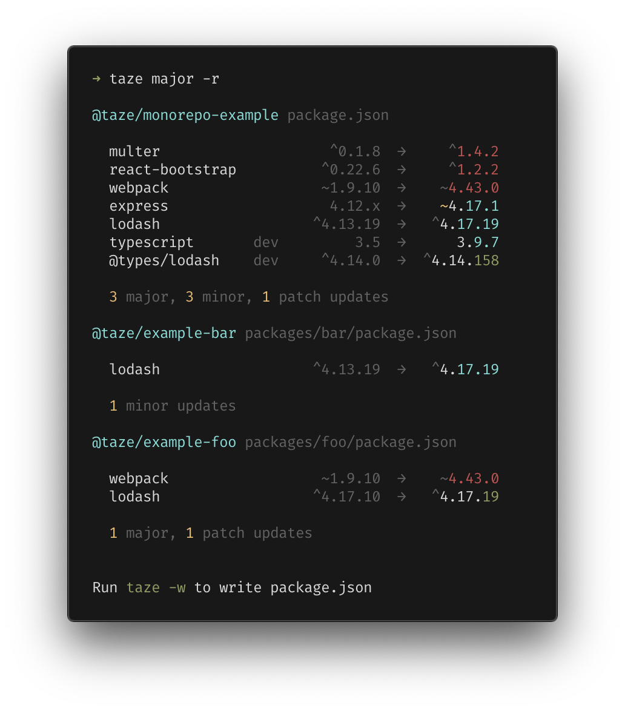
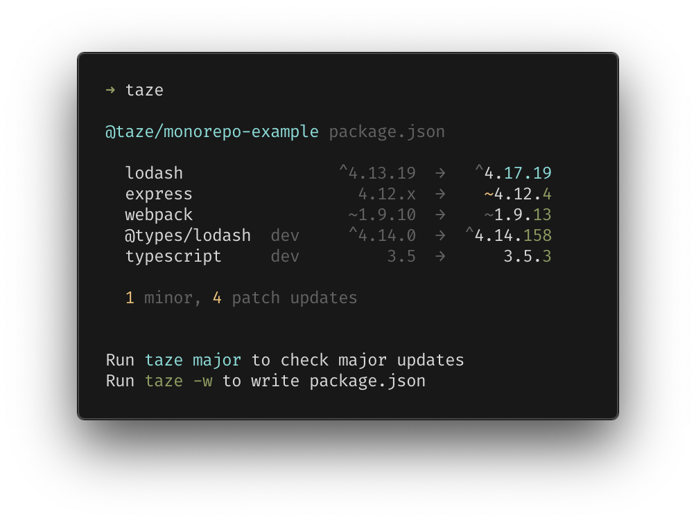
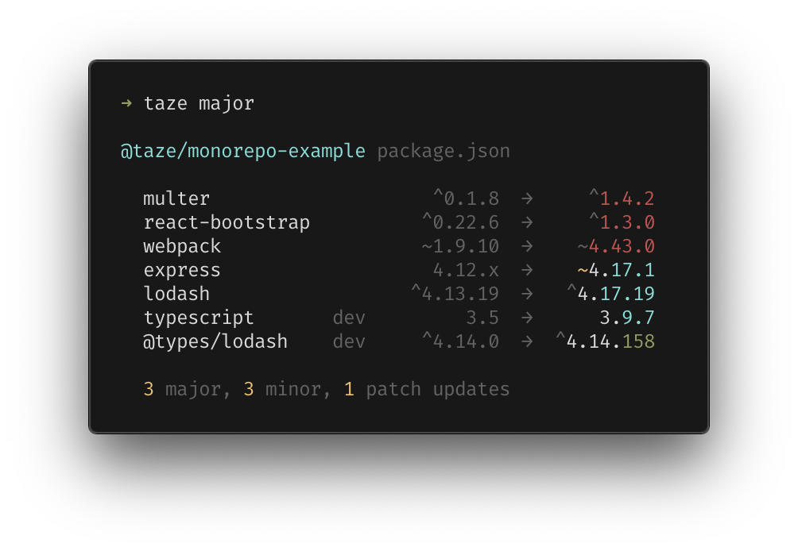
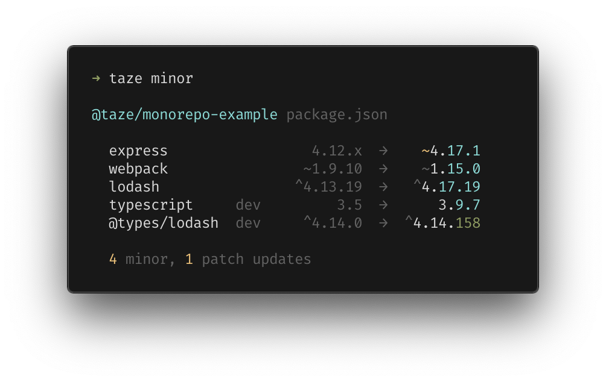
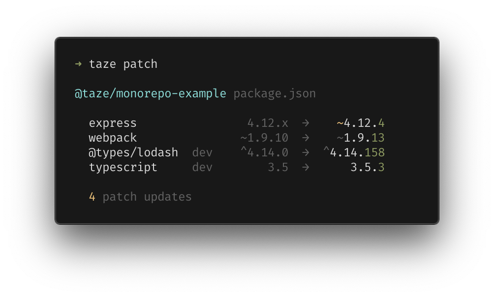
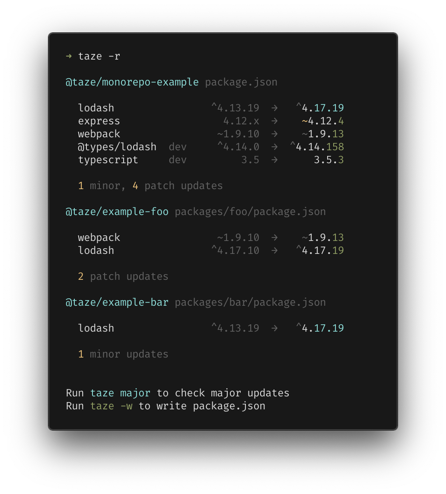

<h1 align="center">🥦 Taze</h1>
<p align="center"><sup>(/ta:zei/, <em>fresh</em> in Persian)</sup></p>
<p align="center">A modern cli tool that keeps your deps fresh</p>

<pre align="center">npx <b>taze</b></pre>

<p align="center">or recursively for <b>monorepos</b></p>

<pre align="center">npx taze <b>-r</b></pre>

<p align="center">or for <em>agents</em> to consume</p>

<pre align="center">npx taze -r <b>--json</b></pre>

<p align='center'>

</p>

## Features

- Built-in support for monorepos
- No installation required — `npx taze`
- Safe by default — updates in the version range you are allowed
- Interactive mode to select which packages to update
- Respects `package.json`'s `engines` field and your package manager's config
- Updates GitHub Actions in your workflows, with optional SHA pinning
- Updates Node.js versions declared in `.node-version`
- Agents compatible JSON output

## Usage

By default, `taze` will only bump versions in the ranges you specified in `package.json` *(which is safe and the default behavior of `npm install`)*

<p align='center'>

</p>

To ignore the ranges, explicitly set the maximum allowed version change.

For example `taze major` will check all changes and bump to the latest stable changes including majors (breaking changes), or `taze minor` that bump to latest minor changes within the same major version.

<br>
<p align='center'>
Check for <b>major</b> updates
<br>

</p>

<p align='center'>
Check up to <b>minor</b> updates
<br>

</p>

<p align='center'>
Check up to <b>patch</b> updates
<br>

</p>

### Monorepo

`taze` has the built-in first-class monorepo support. Simply adding `-r` will scan the subdirectories that contain `package.json` and update them together. It will handle local private packages automatically.

<p align='center'>

</p>

## Configuration

See `taze --help` for more details

### Filters

You can filter out packages you want to check for upgrades by `--include` or `--exclude`; they accept string and regex, separated by commas (,).

```bash
taze --include lodash,webpack
taze --include /react/ --exclude react-dom # regex is also supported
```

`--exclude` (and `--include`) also accepts a `name@range` selector to exclude only a specific version range of a package, instead of the whole package. This is useful to block a specific major version while still allowing other updates (including in interactive mode):

```bash
# skip typescript's major v7 (and later), but still offer v6 minor/patch updates
taze --exclude typescript@7
taze --exclude "typescript@^7||^8" # multiple ranges can be combined with ||
```

Dependencies listed in pnpm's `update.ignoreDeps` in `pnpm-workspace.yaml` are automatically excluded, so packages you tell pnpm never to update are also skipped by taze.

### Locked Versions

Locked (fixed version without `^` or `~`) packages are skipped by default, use `taze --include-locked` or `taze -l` to show them.

### Peer Dependencies

Bumping version in `peerDependencies` is not enabled by default. Pass `--peer` option to include them in the update process.

```bash
taze --peer
```

### Maturity Period

By default the most recent version of a dependency is used. You may choose to filter to versions that have been out longer by passing `--maturity-period`.

```bash
taze --maturity-period
```

The filter when using the maturity-period flag is 7 days. You may also want to pass a day value to have a longer or shorter number of days.

```bash
taze --maturity-period 14
```

You can exclude packages from the maturity filter. This is also inferred from package manager config when available, such as `minimumReleaseAgeExclude` in `pnpm-workspace.yaml` and `npmPreapprovedPackages` in `.yarnrc.yml`.

```bash
taze --maturity-period-exclude react,webpack
```

If you want stable releases only while still honoring the maturity period, use `stable` mode.

```bash
taze stable --maturity-period 14
```

> [!NOTE]
> This kind of filtering is sometimes called `cooldown` or `minimumReleaseAge` by other tools.

### JSON Output

Pass `--json` to output the resolved update info as JSON to stdout instead of the rendered table. This is handy for scripting and CI.

```bash
taze --json
```

When `--json` is used, `--interactive` is ignored and no progress bars, tables, or tips are printed. By default only dependencies with an available update are included; combine it with `--all` to include up-to-date dependencies too. It can still be combined with `-w` to write changes back to their declaration files.

### Node.js versions

`taze` checks a `.node-version` file in the current directory. With `-r`, it also checks nested `.node-version` files while honoring `ignorePaths` and `ignoreOtherWorkspaces`. The file does not need a neighboring `package.json`.

```bash
taze                   # stay on the current Node.js major
taze patch             # stay on the current major and minor
taze major -w          # allow a newer major and write the file
taze --no-node-version # opt out
```

Only stable numeric references with an optional `v` prefix are supported: `22`, `22.14`, and `v22.14.0`. Aliases, ranges, prereleases, and other content are left unchanged. Taze preserves the prefix, the number of numeric segments, surrounding whitespace, and the final newline. A major-only reference such as `22` already floats within Node.js 22 in the default mode, while `taze major` can update it to a newer major.

| Mode | Allowed Node.js releases |
| --- | --- |
| `patch` | Current major and minor |
| default, `minor`, `stable` | Current major |
| `major`, `latest`, `newest`, `next` | All newer stable releases |

Versions and release dates come from the official [Node.js distribution index](https://nodejs.org/dist/index.json), so `maturityPeriod` and version-specific exclusions also apply. Filters use the dependency name `node`, including `--include node`, `--exclude node`, and `packageMode.node`. `--include-locked` does not change `.node-version` behavior.

Writing the file does not install or switch the active Node.js runtime. `--install` and `--update` keep their existing package-manager meaning.

### GitHub Actions

`taze` also checks the GitHub Actions used in your workflows. When a `.github/workflows` directory exists, it scans `.github/workflows/*.{yml,yaml}`, composite actions (`.github/actions/**/action.{yml,yaml}` and a repo-root `action.{yml,yaml}`), and reusable workflow calls, then reports newer versions alongside your npm dependencies. It works with every mode (`major`, `minor`, ...), `--interactive`, `--json`, and `-w`.

```bash
taze major -w      # also updates outdated actions, e.g. actions/checkout@v3 -> @v4
taze --no-github-actions   # opt out
```

References are updated in place while preserving the granularity you wrote (`@v4` → `@v5`, `@v4.1.1` → `@v4.2.0`). By default the existing style of each action is kept: tag references stay tags, while SHA-pinned references stay pinned (with a refreshed `# vX.Y.Z` comment). Choose a style explicitly with `--github-actions-style <auto|tag|sha>`:

```yaml
# style: sha — pin to an immutable commit for supply-chain safety
- uses: actions/checkout@08c6903cd8c0fde910a37f88322edcfb5dd907a8 # v5.0.0
# style: tag
- uses: actions/checkout@v5
```

Only `v`-prefixed version tags are considered; branch refs (`@main`), non-`v` tags, `docker://` and local (`./`) actions are left untouched. Filtering (`--include`/`--exclude`/`packageMode`), the maturity-period cool-down, and mode all apply, matched by the action's `owner/repo` name.

Versions are fetched from the GitHub REST API. Set a `GITHUB_TOKEN` (or `GH_TOKEN`) to raise the rate limit from 60 to 5000 requests/hour:

```bash
GITHUB_TOKEN=xxxx taze major
```

If neither is set, taze falls back to a token from the [GitHub CLI](https://cli.github.com) (`gh auth token`) when you're logged in, so an authenticated `gh` needs no extra configuration.

### Config file

With `taze.config.js` file, you can configure the same options the command has.

```js
import { defineConfig } from 'taze'

export default defineConfig({
  // ignore packages from bumping
  exclude: [
    'webpack'
  ],
  // fetch latest package info from registry without cache
  force: true,
  // use a custom fast-npm-meta compatible API endpoint
  fastNpmMetaApiEndpoint: 'https://npm.example.com/',
  // retry behavior when fetching package metadata fails:
  // a number for retry count, `false` to disable, or an object for fine-grained
  // control, e.g. { retries: 4, factor: 2, minTimeout: 1000, maxTimeout: 30_000, randomize: false }
  retry: 4,
  // write changes to supported declaration files
  write: true,
  // run `npm install` or `yarn install` right after bumping
  install: true,
  // ignore paths when searching supported files in a monorepo
  ignorePaths: [
    '**/node_modules/**',
    '**/test/**',
  ],
  // ignore files in other workspaces (with their own .git, pnpm-workspace.yaml, etc.)
  ignoreOtherWorkspaces: true,
  // override with different bumping mode for each package
  packageMode: {
    'typescript': 'major',
    'unocss': 'ignore',
    // regex starts and ends with '/'
    '/vue/': 'latest'
  },
  // exclude packages from the maturity period filter
  maturityPeriodExclude: [
    'react',
    '@myorg/*',
  ],
  // disable checking for "overrides" package.json field
  depFields: {
    overrides: false
  },
  // GitHub Actions updates: `true` (default) | `false` to opt out | options object
  githubActions: {
    // 'auto' (preserve existing style) | 'tag' | 'sha'
    style: 'auto'
  },
  // .node-version updates are enabled by default
  nodeVersion: true
})
```

## Alternatives

`taze` is inspired by the following tools.

- [npm-check-updates](https://github.com/raineorshine/npm-check-updates)
- [npm-check](https://github.com/dylang/npm-check)

They work well but have different focuses and feature sets, try them out as well :)

## Thanks

Great thanks to [@sinoon](https://github.com/sinoon) who helped a lot with idea brainstorming and feedback discussion.

The GitHub Actions updating feature is inspired by and credits [actions-up](https://github.com/azat-io/actions-up) by [Azat S.](https://azat.io), which pioneered the interactive SHA-pinning workflow this builds upon.

## License

MIT License © 2020 [Anthony Fu](https://github.com/antfu)
